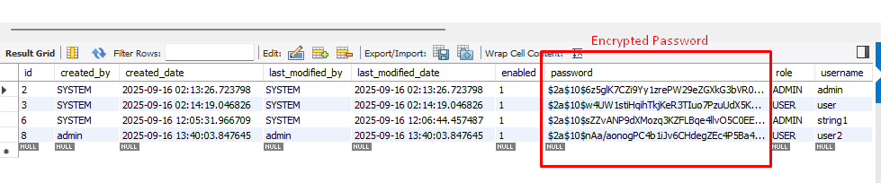

=========================================

1) POST /auth/login

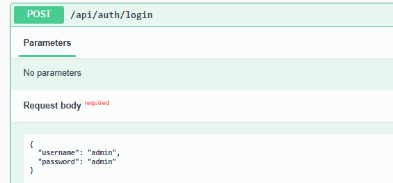
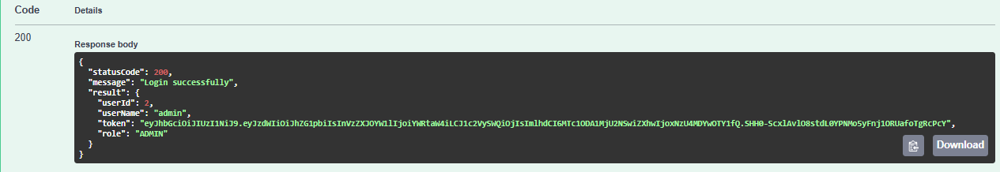

==========================================

2) GET /resources — list (paginated)
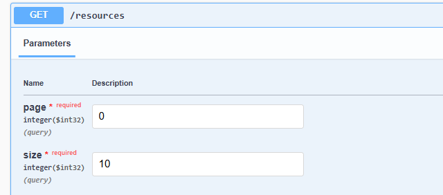
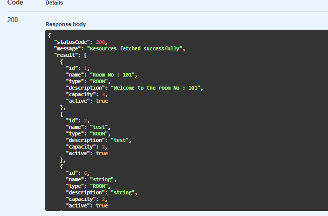

3) GET /resources/{id} — details
 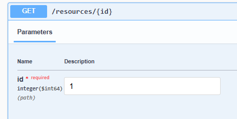
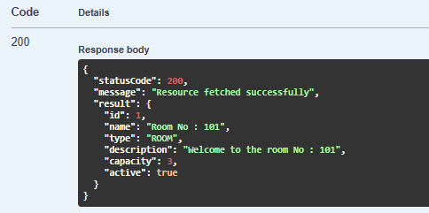

4)POST /resources — ADMIN only

    Role ====> "ADMIN"
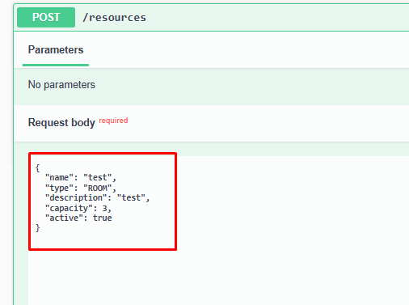
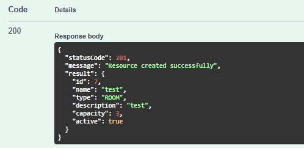

    Role ====> "USER"
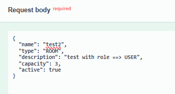
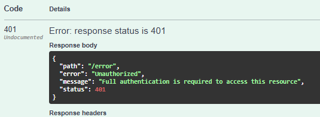

5) PUT /resources/{id} — ADMIN only

    Role ====> "ADMIN"

    Valid Id
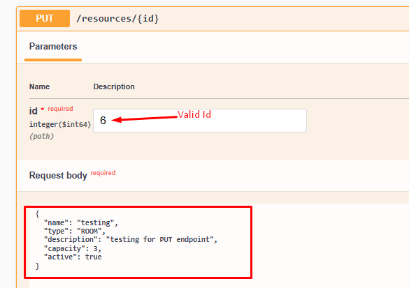
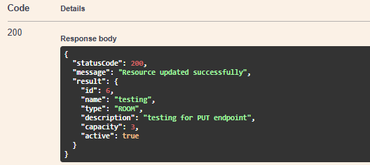

Invalid Id
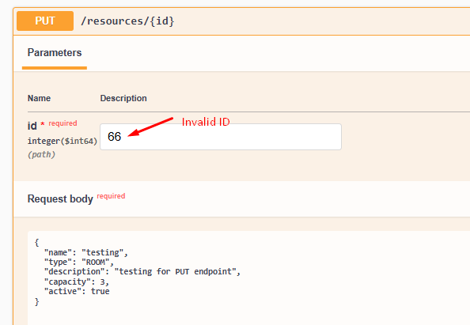
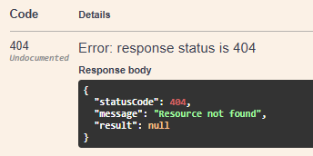

    Role ====> "USER"
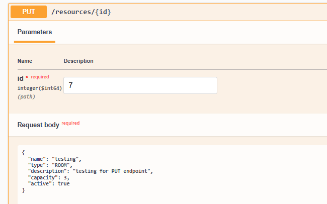
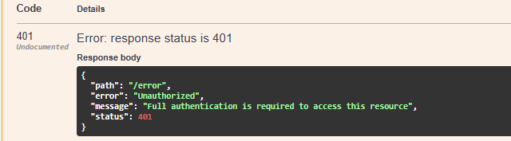

6) DELETE /resources/{id} — ADMIN only

    Role ====> "ADMIN"

    Invalid Id
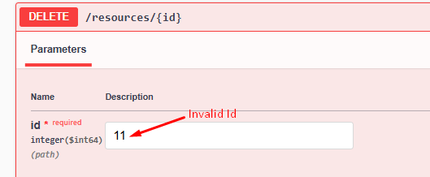
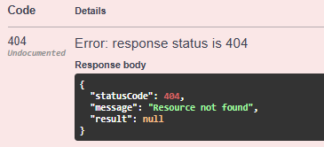

Valid ID

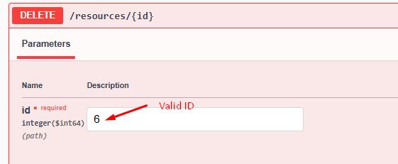
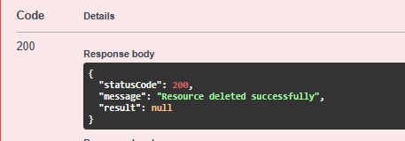

    Role ====> "USER"

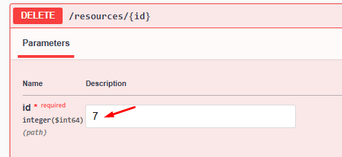
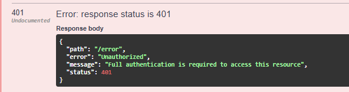

==========================================

RESERVATIONS

7)POST /reservations

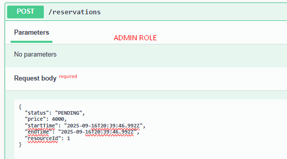
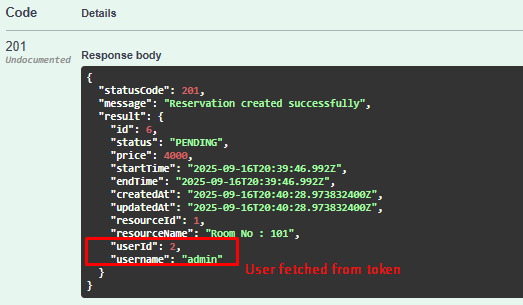

8) GET /reservations

   ADMIN: list all

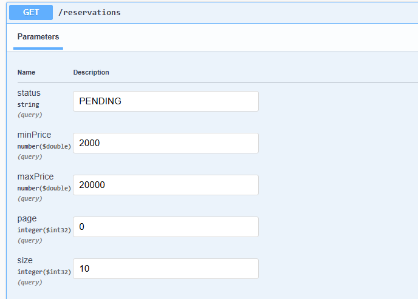
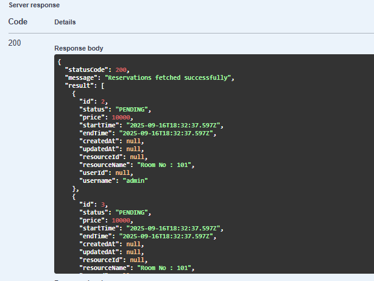

   USER: list own only

